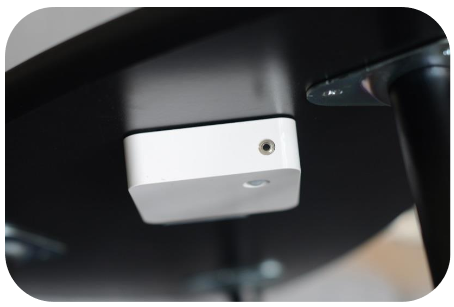
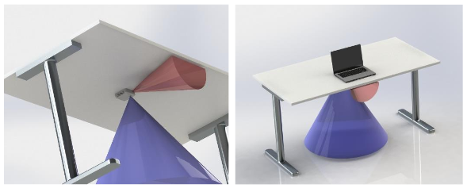

# ELSYS ERS Desk

[Operating Manual](https://elsys.se/public/manuals/Operating%20Manual%20ERS%20Desk.pdf)  
[Datasheet](https://elsys.se/public/datasheets/ERS_Desk_datasheet.pdf)  

Uses termopile sensor that measures occupancy using a narrow field of view sensor and is useful for desks.

Mount the sensor under the desk at approximately 10-40 cm from the edge with the temperature sensor pointed towards the chair (see image).

**Occupancy Payload Definition**:  
0: Unoccupied  
1: Pending (entering or leaving)  
2: Occupied  
  
  
## Assets
| Name        | Title           | Unit | Data Type | Asset Type |
| ----------- | --------------- | ---- | --------- | ---------- |
| occupancy   | Occupancy       | -    | integer   | sensor     |
| motion      | Motion Count    | -    | integer   | sensor     |
| light       | Light Level     | Lux  | integer   | sensor     |
| humidity    | Humidity        | %    | integer   | sensor     |
| temperature | Temperature     | °C   | number    | sensor     |
| battery     | Battery Voltage | V    | number    | sensor     |

## Rules

| Rule                            | Notification Body                                                                                                                       | State   | Notifies via | People Notified |
| ------------------------------- | --------------------------------------------------------------------------------------------------------------------------------------- | ------- | ------------ | --------------- |
| If Battery Voltage <= 3.0 Volts | {{{{deviceId}}/%title}} battery voltage is low at {{{{deviceId}}/battery}}V! Replace the battery as soon as possible to avoid downtime. | Enabled | Web + E-Mail | Owner           |
| Watchdog, 30 minutes            | -                                                                                                                                       | Enabled | Web + E-Mail | Owner           |

