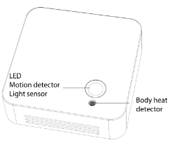

# ELSYS ERS Eye

> Device Type: `elsys/ers-eye`  

[Operating Manual](https://elsys.se/public/manuals/Operating%20Manual%20ERS%20Eye.pdf)
[Datasheet](https://elsys.se/public/datasheets/ERS_Eye_datasheet.pdf)

Has a Panasonic Grid Eye infrared sensor that detects heat signatures which measures occupancy using a wide field of view (60 degrees X+Y) and range of 5 meters.
Good for meeting rooms. 

Preferably place the ERS Eye in the ceiling at between 2.2 to 5 meters height, or high up on the wall. Do not place the sensor so it faces windows or moving heat sources; this can cause a false positive reading.

  

**Occupancy Payload Definition:**
0: Nobody
1: PIR Sensor Triggered
2: Heat Triggered (Grid-Eye Sensor Triggered)

## Assets
| Name        | Title           | Unit | Data Type | Asset Type |
| ----------- | --------------- | ---- | --------- | ---------- |
| occupancy   | Occupancy       | -    | integer   | sensor     |
| motion      | Motion Count    | -    | integer   | sensor     |
| light       | Light Level     | Lux  | integer   | sensor     |
| humidity    | Humidity        | %    | integer   | sensor     |
| temperature | Temperature     | °C   | number    | sensor     |
| battery     | Battery Voltage | V    | number    | sensor     |
| raw_downlink | Raw Downlink (Configuration) | | string | actuator |

## Rules
| Rule                            | Notification Body                                                                                                                       | State   | Notifies via | People Notified |
| ------------------------------- | --------------------------------------------------------------------------------------------------------------------------------------- | ------- | ------------ | --------------- |
| If Battery Voltage <= 3.0 Volts | {{{{deviceId}}/%title}} battery voltage is low at {{{{deviceId}}/battery}}V! Replace the battery as soon as possible to avoid downtime. | Enabled | Web + E-Mail | Owner           |
| Watchdog, 30 minutes            | -                                                                                                                                       | Enabled | Web + E-Mail | Owner           |

