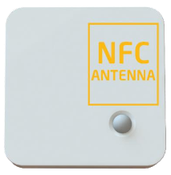
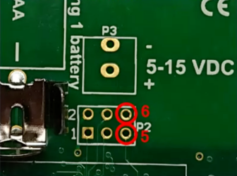
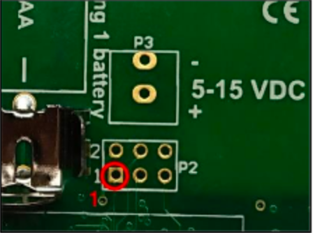
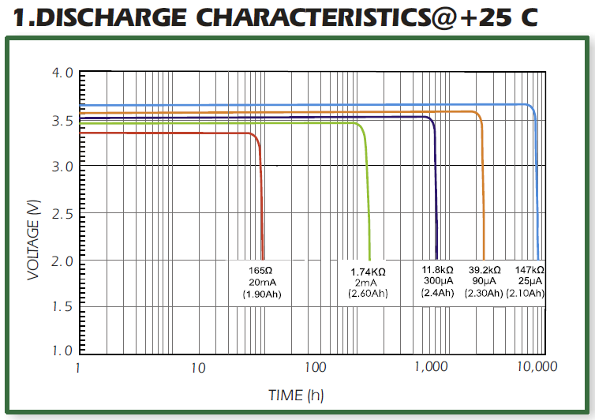
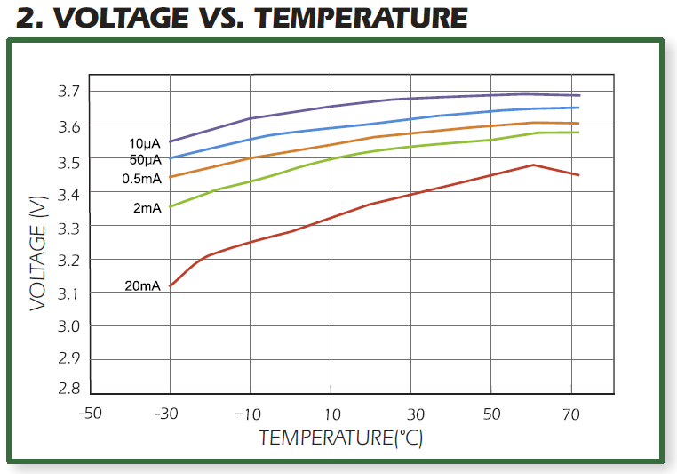
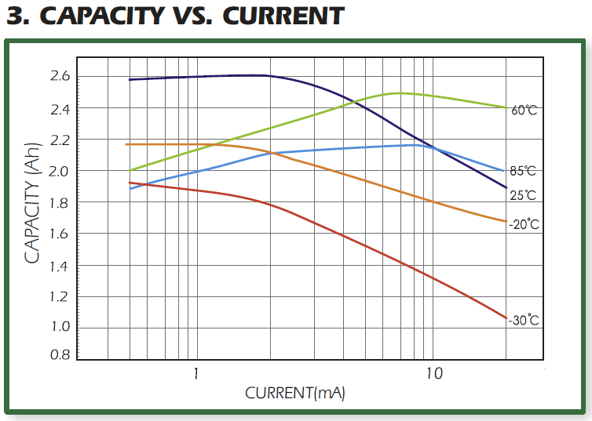

# ELSYS ERS Series of Sensors

ELSYS Official Document: [General Operating Manual and Specifications](https://elsys.se/public/manuals/Operating%20Manual%20ERS.pdf)  

## Sensing Abilities  

| ERS Desk                        | ERS Eye                     | ERS CO2          | ERS Sound        |
| ------------------------------- | --------------------------- | ---------------- | ---------------- |
| Temperature (°C)                | Temperature (°C)            | Temperature (°C) | Temperature (°C) |
| Humidity (% RH)                 | Humidity (% RH)             | Humidity (% RH)  | Humidity (% RH)  |
| Light (Lux)                     | Light (Lux)                 | Light (Lux)      | Light (Lux)      |
| Motion                          | Motion                      | Motion           | Motion           |
| Occupancy (Termopile IR Sensor) | Occupancy (Grid-Eye Sensor) | CO2 Sensor (ppm) | Loudness (dBspl) |

## Device Configuration

- [Device Settings Parameters](https://elsys.se/public/documents/sensor_settings_parameter.pdf)
- [Device Payload Structure and Info](https://elsys.se/public/documents/Elsys-LoRa-payload.pdf)

All sensor settings can be configured via a smartphone application with NFC (Near Field Communication) or over the air via the network server and downlink data to the sensor. The sampling rate, spreading factor, encryption keys, port,and modes can be changed. All sensor settings can be locked from the server or NFCto make end-users unable toread or change settings on the sensor. 

1. Download ELSYS “Sensor Settings” application from Google Play or App Store (from iOS 13) and install it on a smartphone or tablet. The device must support NFC.
2. Enable NFC on the device and start the application.
3. Place your device on top of the NFC antenna on the sensor.
4. Remove the device. Current settings will be displayed in the application.
5. Use the application to change any settings if needed.
6. Quickly tap the device on top of the NFC antenna to give the new settings to the sensor. Make sure that the application confirms your new settings.
7. Wait for the sensor to reboot (5 sec), indicated by the LED flashing. Sensor settings have been updated

## Over-the-air Configuration

All settings may be configured over the air via your LoRaWAN® infrastructure. 
[Use the downlink generator.](https://www.elsys.se/en/downlink-generator/)

## Resetting (Missing DevEUI)  

In case your ERS device seems to have an empty DevEUI, the solution is to reset the device itself.

- Open the back cover of the ERS device
- Make sure a battery is inserted
- Connect pins 5 and 6 (as shown in the photo) using tweezers or a piece of wire
- The device should reset
- Check if the DevEUI is present now using the NFC app

> The missing DevEUI issue happens sometimes when certain models of Samsung phones are used to read/write the data to/from the ERS device.

## Updating Firmware  

> In order to update the firmware of any of the ERS devices, a special device called Elsys Programming Stick is required.

The Programming Stick acts as a normal USB drive that you paste the firmware onto. 
You then use the pogo pins present on the stick and make contact with the ERS device (6 pins) after which the ERS device itself powers the programming stick and loads the new firmware from (because of this, the battery needs to be present in the ERS device for it to update itself).

- Download the firmware for the appropriate ERS device here  
    Note: ELSYS ERS CO2 is just “ERS”  
- Plug the Elsys Programming Stick into your computer via Micro-USB Cable. It’ll appear as a small USB drive.
- Paste the desired .bin file to the programming stick and wait about 5 seconds  
    LED Flashing Orange = FAT Error  
    LED Flashing Red = Internal Error  
    Otherwise, everything is fine  
- Disconnect it from your computer
- Open up the back cover of your ELSYS Device
- Make sure you have a battery inserted
- Hold the programming stick to the programming port on the ERS device (match the 1 on the ERS with the 1 on the Programming Stick)
- The programming stick will flash in the following manner: **Red > Green > Flashing Red > Flashing Green (Done)**  
    The color codes are as follows:  
    LED fixed red: Error or startup  
    LED fixed green: Started programming  
    LED flashing orange: FW/Bin file error  
    LED flashing red: Programming  
    LED flashing green: Done  
- Done! You can use the NFC app to check if the firmware is the newest version.  

## Motion Sensors (PIR)

Each ERS device has a PIR (motion) sensor. All of them have a blanking time of 30 seconds of the PIR triggering after each PIR trigger and after each transmission. This is to reduce the risk of self-triggering from internal events that could disturb the high sensitivity PIR circuits.

**Motion Sensor Payload Definition**
0-255: Number of motion counts

## Battery Performance

The devices will run until the voltage of the battery is 2.0V, but the temperature, accelerometer, CO2, etc. sensors will start to fail around 2.5V-2.9V because they’re “independent” components that behave differently and have different ratings.
Each given device draws between 8uA and 13mA when “sleeping” and about 60mA when sending data.
Generally, if the battery voltage is under 3V, it’s time to change it. However, it’s worth nothing that the sensor can potentially run for weeks after that.

  

  

  